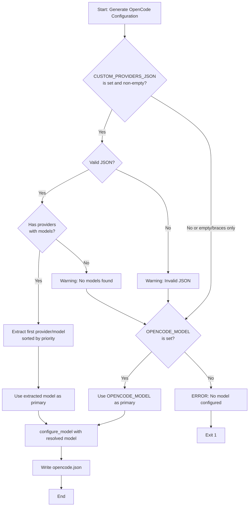

# Architecture Design: Custom Providers Priority Logic

## Executive Summary

This document specifies the implementation for priority logic in the `bot-setup` GitHub Action that ensures `CUSTOM_PROVIDERS_JSON` takes precedence over `OPENCODE_MODEL` when configured. The core change involves adding a **model resolution phase** before the existing `configure_model` function is called. When `CUSTOM_PROVIDERS_JSON` contains valid provider definitions with models, the primary model will be automatically extracted from it, ignoring the `OPENCODE_MODEL` input. This eliminates the conflict where users must manually synchronize these two secrets.

---

## 1. Problem Statement

### Current Behavior (Problematic)
- `OPENCODE_MODEL` is a **required** input (line 16 of `action.yml`)
- The action **always** calls `configure_model "$MAIN_MODEL" "model"` using `OPENCODE_MODEL`
- `CUSTOM_PROVIDERS_JSON` is merged into config but doesn't influence model selection
- Users who configure custom providers must manually update `OPENCODE_MODEL` to match

### Desired Behavior
- If `CUSTOM_PROVIDERS_JSON` is configured (non-empty, contains at least one provider with models):
  - **Automatically extract** the primary model from custom providers
  - **Ignore** the `OPENCODE_MODEL` value entirely
- If `CUSTOM_PROVIDERS_JSON` is NOT configured (empty, `{}`, or invalid):
  - **Fall back** to using `OPENCODE_MODEL` as the primary model

---

## 2. Files to Modify

| File | Change Type | Description |
|------|-------------|-------------|
| [`.github/actions/bot-setup/action.yml`](.github/actions/bot-setup/action.yml) | Modify | Add model resolution logic, make `opencode-model` optional |

---

## 3. Detailed Design

### 3.1 Input Changes

**Current** (line 14-16):
```yaml
  opencode-model:
    description: 'The main model to use (e.g., openai/gpt-4o or a custom one from custom providers JSON).'
    required: true
```

**Proposed**:
```yaml
  opencode-model:
    description: 'The default model to use when custom-providers-json is not configured. Ignored when custom providers are present.'
    required: false
    default: ''
```

### 3.2 Model Resolution Logic

Add a new function **before** line 109 (before `configure_model` function definition):

```bash
# --- MODEL RESOLUTION: CUSTOM_PROVIDERS TAKES PRIORITY ---
# This function determines the actual primary model to use based on priority rules:
# 1. If CUSTOM_PROVIDERS_JSON has valid providers with models → extract first model
# 2. Otherwise → use OPENCODE_MODEL as fallback
#
# Outputs:
#   RESOLVED_MODEL - The model string to use (e.g., "my-provider/my-model")
#   MODEL_SOURCE   - Either "custom_providers" or "opencode_model" (for logging)
resolve_primary_model() {
  local custom_providers="$1"
  local fallback_model="$2"
  
  # Edge case 1: CUSTOM_PROVIDERS is empty or "{}"
  if [ -z "$custom_providers" ] || [ "$custom_providers" = "{}" ]; then
    if [ -z "$fallback_model" ]; then
      echo "::error::No model configured. Either set CUSTOM_PROVIDERS_JSON with providers/models, or set OPENCODE_MODEL."
      exit 1
    fi
    RESOLVED_MODEL="$fallback_model"
    MODEL_SOURCE="opencode_model"
    echo "Model source: OPENCODE_MODEL (no custom providers configured)"
    return 0
  fi
  
  # Edge case 2: Validate CUSTOM_PROVIDERS is valid JSON
  if ! echo "$custom_providers" | jq empty 2>/dev/null; then
    echo "::warning::CUSTOM_PROVIDERS_JSON contains invalid JSON. Falling back to OPENCODE_MODEL."
    if [ -z "$fallback_model" ]; then
      echo "::error::CUSTOM_PROVIDERS_JSON is invalid and no OPENCODE_MODEL fallback is set."
      exit 1
    fi
    RESOLVED_MODEL="$fallback_model"
    MODEL_SOURCE="opencode_model"
    return 0
  fi
  
  # Edge case 3: CUSTOM_PROVIDERS is valid JSON but has no providers (empty object structure)
  local provider_count
  provider_count=$(echo "$custom_providers" | jq 'keys | length')
  if [ "$provider_count" -eq 0 ]; then
    if [ -z "$fallback_model" ]; then
      echo "::error::CUSTOM_PROVIDERS_JSON is empty and no OPENCODE_MODEL fallback is set."
      exit 1
    fi
    RESOLVED_MODEL="$fallback_model"
    MODEL_SOURCE="opencode_model"
    echo "Model source: OPENCODE_MODEL (custom providers object is empty)"
    return 0
  fi
  
  # Extract the first provider and its first model (sorted by priority if available)
  # Priority logic: models with lower "priority" value come first; default priority is 999
  local first_provider
  first_provider=$(echo "$custom_providers" | jq -r 'keys[0]')
  
  # Check if this provider has any models defined
  local models_obj
  models_obj=$(echo "$custom_providers" | jq -r --arg p "$first_provider" '.[$p].models // empty')
  
  if [ -z "$models_obj" ] || [ "$models_obj" = "null" ] || [ "$models_obj" = "{}" ]; then
    echo "::warning::First provider '$first_provider' has no models defined."
    
    # Try to find any provider with models
    local provider_with_models
    provider_with_models=$(echo "$custom_providers" | jq -r '
      to_entries 
      | map(select(.value.models != null and (.value.models | keys | length) > 0)) 
      | .[0].key // empty
    ')
    
    if [ -z "$provider_with_models" ]; then
      echo "::warning::No providers in CUSTOM_PROVIDERS_JSON have models defined. Falling back to OPENCODE_MODEL."
      if [ -z "$fallback_model" ]; then
        echo "::error::No models found in CUSTOM_PROVIDERS_JSON and no OPENCODE_MODEL fallback is set."
        exit 1
      fi
      RESOLVED_MODEL="$fallback_model"
      MODEL_SOURCE="opencode_model"
      return 0
    fi
    
    first_provider="$provider_with_models"
    models_obj=$(echo "$custom_providers" | jq -r --arg p "$first_provider" '.[$p].models')
  fi
  
  # Get the first model from this provider, sorted by priority (lower = higher priority)
  local first_model
  first_model=$(echo "$models_obj" | jq -r '
    to_entries 
    | sort_by(.value.priority // 999) 
    | .[0].key
  ')
  
  if [ -z "$first_model" ] || [ "$first_model" = "null" ]; then
    echo "::error::Failed to extract model from provider '$first_provider'."
    if [ -z "$fallback_model" ]; then
      exit 1
    fi
    RESOLVED_MODEL="$fallback_model"
    MODEL_SOURCE="opencode_model"
    return 0
  fi
  
  RESOLVED_MODEL="${first_provider}/${first_model}"
  MODEL_SOURCE="custom_providers"
  echo "Model source: CUSTOM_PROVIDERS_JSON (resolved to: $RESOLVED_MODEL)"
  return 0
}
```

### 3.3 Integration Point

**Replace** lines 154-158 in `action.yml`:

**Current Code** (lines 154-158):
```bash
        # --- EXECUTION ---
        configure_model "$MAIN_MODEL" "model"
        if [ -n "$FAST_MODEL" ]; then
          configure_model "$FAST_MODEL" "small_model"
        fi
```

**Proposed Code**:
```bash
        # --- MODEL RESOLUTION (PRIORITY: CUSTOM_PROVIDERS > OPENCODE_MODEL) ---
        resolve_primary_model "$CUSTOM_PROVIDERS" "$MAIN_MODEL"
        
        # Log the resolution decision for debugging
        echo "DEBUG: Resolved primary model: $RESOLVED_MODEL (source: $MODEL_SOURCE)"
        
        # Use the resolved model instead of blindly using MAIN_MODEL
        EFFECTIVE_MAIN_MODEL="$RESOLVED_MODEL"
        
        # --- EXECUTION ---
        configure_model "$EFFECTIVE_MAIN_MODEL" "model"
        if [ -n "$FAST_MODEL" ]; then
          # Fast model still comes from OPENCODE_FAST_MODEL input (no change)
          configure_model "$FAST_MODEL" "small_model"
        fi
```

### 3.4 Update Fallback Export Step

The "Export Fallback Models List" step (lines 167-218) must also use the resolved model. 

**Add at the beginning of the step** (after line 173):

```bash
        # --- Use the same resolution logic for consistency ---
        # Re-resolve the model (or pass it from previous step via env)
        CUSTOM_PROVIDERS="${INPUT_CUSTOM_PROVIDERS}"
        if [ -z "$CUSTOM_PROVIDERS" ] || [ "$CUSTOM_PROVIDERS" = "{}" ]; then
          CUSTOM_PROVIDERS='{}'
        fi
        
        # Determine effective main model using priority logic
        if [ "$CUSTOM_PROVIDERS" != "{}" ]; then
          # Custom providers configured - extract first model
          EFFECTIVE_MAIN_MODEL=$(echo "$CUSTOM_PROVIDERS" | jq -r '
            to_entries 
            | map(select(.value.models != null and (.value.models | keys | length) > 0)) 
            | .[0] as $provider
            | ($provider.value.models | to_entries | sort_by(.value.priority // 999) | .[0].key) as $model
            | "\($provider.key)/\($model)"
          ')
          
          if [ -z "$EFFECTIVE_MAIN_MODEL" ] || [ "$EFFECTIVE_MAIN_MODEL" = "null/" ] || [ "$EFFECTIVE_MAIN_MODEL" = "/" ]; then
            EFFECTIVE_MAIN_MODEL="$INPUT_MAIN_MODEL"
          fi
        else
          EFFECTIVE_MAIN_MODEL="$INPUT_MAIN_MODEL"
        fi
        
        echo "DEBUG: Effective main model for fallback export: $EFFECTIVE_MAIN_MODEL"
```

**Then replace** line 175-176:
```bash
        PROVIDER="${INPUT_MAIN_MODEL%%/*}"
        MODEL_NAME="${INPUT_MAIN_MODEL#*/}"
```

**With**:
```bash
        PROVIDER="${EFFECTIVE_MAIN_MODEL%%/*}"
        MODEL_NAME="${EFFECTIVE_MAIN_MODEL#*/}"
```

**And replace** line 185, 192, 210, 213:
Every reference to `$INPUT_MAIN_MODEL` in this step should become `$EFFECTIVE_MAIN_MODEL`.

---

## 4. Edge Cases & Error Handling

| Edge Case | Detection | Behavior |
|-----------|-----------|----------|
| `CUSTOM_PROVIDERS_JSON` is empty string | `[ -z "$custom_providers" ]` | Fall back to `OPENCODE_MODEL` |
| `CUSTOM_PROVIDERS_JSON` is `{}` | `[ "$custom_providers" = "{}" ]` | Fall back to `OPENCODE_MODEL` |
| `CUSTOM_PROVIDERS_JSON` is invalid JSON | `jq empty` returns non-zero | Warning + fall back to `OPENCODE_MODEL` |
| Provider exists but has no `models` key | `jq '.[$p].models // empty'` returns empty | Try next provider, then fall back |
| All providers have no models | Loop through all providers | Fall back to `OPENCODE_MODEL` |
| `OPENCODE_MODEL` also not set | Both empty | **Fatal error** - exit 1 |
| Model has no `priority` field | `sort_by(.value.priority // 999)` | Defaults to priority 999 (low) |

---

## 5. Complete Modified Shell Script Section

Below is the complete replacement for lines 59-166 of `action.yml` (the shell script inside "Generate OpenCode Configuration" step):

```bash
      run: |
        set -e # Exit immediately if a command fails

        # --- HARDCODED TOGGLE ---
        ADD_REASONING_EFFORT="true"

        mkdir -p ~/.config/opencode

        # --- INPUTS ---
        MAIN_MODEL="${INPUT_MAIN_MODEL}"
        FAST_MODEL="${INPUT_FAST_MODEL}"
        DEFAULT_API_KEY="${INPUT_DEFAULT_API_KEY}"
        CUSTOM_PROVIDERS="${INPUT_CUSTOM_PROVIDERS}"

        # --- DEBUG ---
        echo "DEBUG: MAIN_MODEL length: ${#MAIN_MODEL} chars"
        echo "DEBUG: MAIN_MODEL value: ${MAIN_MODEL:0:30}..."
        echo "DEBUG: CUSTOM_PROVIDERS length: ${#CUSTOM_PROVIDERS} chars"
        echo "DEBUG: CUSTOM_PROVIDERS is set: $( [ -n "$CUSTOM_PROVIDERS" ] && echo 'yes' || echo 'no' )"

        # Validate MAIN_MODEL format
        if [[ "$MAIN_MODEL" == "{"* ]] || [[ "$MAIN_MODEL" == '"{'* ]]; then
          echo "::error::OPENCODE_MODEL secret appears to contain JSON. Expected format: provider/model"
          exit 1
        fi

        # Normalize empty CUSTOM_PROVIDERS
        if [ -z "$CUSTOM_PROVIDERS" ] || [ "$CUSTOM_PROVIDERS" = "" ]; then
          CUSTOM_PROVIDERS='{}'
          echo "DEBUG: CUSTOM_PROVIDERS was empty, using default: {}"
        else
          echo "DEBUG: CUSTOM_PROVIDERS has content"
        fi

        # --- INITIAL CONFIG SETUP ---
        CONFIG='{"$schema": "https://opencode.ai/config.json", "username": "masusenseibot-agent", "autoupdate": true}'

        # Merge custom provider definitions
        if [ "$CUSTOM_PROVIDERS" != "{}" ]; then
          echo "Custom provider definitions found. Merging into configuration."
          CONFIG=$(jq --argjson customProviders "$CUSTOM_PROVIDERS" '. * {provider: $customProviders}' <<< "$CONFIG")
        else
          echo "No custom provider definitions supplied."
        fi

        # --- MODEL RESOLUTION FUNCTION ---
        resolve_primary_model() {
          local custom_providers="$1"
          local fallback_model="$2"
          
          # Case: No custom providers
          if [ -z "$custom_providers" ] || [ "$custom_providers" = "{}" ]; then
            if [ -z "$fallback_model" ]; then
              echo "::error::No model configured. Set CUSTOM_PROVIDERS_JSON or OPENCODE_MODEL."
              exit 1
            fi
            RESOLVED_MODEL="$fallback_model"
            MODEL_SOURCE="opencode_model"
            echo "Model source: OPENCODE_MODEL (no custom providers)"
            return 0
          fi
          
          # Case: Invalid JSON
          if ! echo "$custom_providers" | jq empty 2>/dev/null; then
            echo "::warning::CUSTOM_PROVIDERS_JSON is invalid JSON. Falling back to OPENCODE_MODEL."
            if [ -z "$fallback_model" ]; then
              echo "::error::Invalid CUSTOM_PROVIDERS_JSON and no OPENCODE_MODEL fallback."
              exit 1
            fi
            RESOLVED_MODEL="$fallback_model"
            MODEL_SOURCE="opencode_model"
            return 0
          fi
          
          # Case: Empty object
          local provider_count
          provider_count=$(echo "$custom_providers" | jq 'keys | length')
          if [ "$provider_count" -eq 0 ]; then
            if [ -z "$fallback_model" ]; then
              echo "::error::Empty CUSTOM_PROVIDERS_JSON and no OPENCODE_MODEL."
              exit 1
            fi
            RESOLVED_MODEL="$fallback_model"
            MODEL_SOURCE="opencode_model"
            return 0
          fi
          
          # Extract first provider with models, sorted by model priority
          local resolved
          resolved=$(echo "$custom_providers" | jq -r '
            to_entries 
            | map(select(.value.models != null and (.value.models | keys | length) > 0)) 
            | .[0] as $p
            | if $p then
                ($p.value.models | to_entries | sort_by(.value.priority // 999) | .[0].key) as $m
                | "\($p.key)/\($m)"
              else
                empty
              end
          ')
          
          if [ -z "$resolved" ] || [ "$resolved" = "/" ]; then
            echo "::warning::No providers with models in CUSTOM_PROVIDERS_JSON."
            if [ -z "$fallback_model" ]; then
              echo "::error::No usable models found and no OPENCODE_MODEL fallback."
              exit 1
            fi
            RESOLVED_MODEL="$fallback_model"
            MODEL_SOURCE="opencode_model"
            return 0
          fi
          
          RESOLVED_MODEL="$resolved"
          MODEL_SOURCE="custom_providers"
          echo "Model source: CUSTOM_PROVIDERS_JSON → $RESOLVED_MODEL"
          return 0
        }

        # --- CONFIGURE MODEL FUNCTION ---
        configure_model() {
          local model_string="$1"
          local config_key="$2"
          local provider="${model_string%%/*}"
          local model_name="${model_string#*/}"

          if jq -e --arg provider "$provider" '. | has($provider)' <<< "$CUSTOM_PROVIDERS" >/dev/null; then
            echo "Provider '$provider' found in custom definitions."
            
            if ! jq -e --arg provider "$provider" --arg modelName "$model_name" '.[$provider].models | has($modelName)' <<< "$CUSTOM_PROVIDERS" >/dev/null; then
              echo "::error::Model '$model_name' not found in provider '$provider'. Aborting."
              exit 1
            fi
            
            CONFIG=$(jq --arg key "$config_key" --arg val "$model_string" '.[$key] = $val' <<< "$CONFIG")
          else
            echo "Provider '$provider' not in custom definitions. Configuring as standard provider."
            CONFIG=$(jq --arg key "$config_key" --arg val "$model_string" '.[$key] = $val' <<< "$CONFIG")
            CONFIG=$(jq --arg provider "$provider" --arg apiKey "$DEFAULT_API_KEY" \
              '.provider[$provider].options.apiKey = $apiKey' <<< "$CONFIG")
            
            if [[ "$config_key" == "model" && "$ADD_REASONING_EFFORT" == "true" ]]; then
              echo "Applying reasoning effort to standard provider model."
              CONFIG=$(jq --arg provider "$provider" --arg modelName "$model_name" \
                '.provider[$provider].models[$modelName].options.reasoningEffort = "high"' <<< "$CONFIG")
            fi
          fi
        }

        # --- EXECUTION: RESOLVE THEN CONFIGURE ---
        resolve_primary_model "$CUSTOM_PROVIDERS" "$MAIN_MODEL"
        EFFECTIVE_MAIN_MODEL="$RESOLVED_MODEL"
        echo "DEBUG: Using model: $EFFECTIVE_MAIN_MODEL (source: $MODEL_SOURCE)"
        
        configure_model "$EFFECTIVE_MAIN_MODEL" "model"
        
        if [ -n "$FAST_MODEL" ]; then
          configure_model "$FAST_MODEL" "small_model"
        fi

        # --- FINALIZATION ---
        echo "$CONFIG" > ~/.config/opencode/opencode.json
        echo "Successfully generated OpenCode configuration."
```

---

## 6. Decision Flow Diagram



---

## 7. Implementation Checklist for Code Mode

| # | Task | File | Lines | Effort | Risk |
|---|------|------|-------|--------|------|
| 1 | Change `opencode-model` input to `required: false` with empty default | `action.yml` | 14-16 | XS | Low |
| 2 | Add `resolve_primary_model()` function | `action.yml` | Insert before line 109 | M | Medium |
| 3 | Replace model configuration execution block | `action.yml` | 154-158 | S | Medium |
| 4 | Update fallback export step to use resolved model | `action.yml` | 173-218 | S | Medium |
| 5 | Test with CUSTOM_PROVIDERS_JSON only (no OPENCODE_MODEL) | Manual test | - | S | Low |
| 6 | Test with OPENCODE_MODEL only (no custom providers) | Manual test | - | S | Low |
| 7 | Test with both set (custom providers should win) | Manual test | - | S | Low |
| 8 | Test with invalid JSON in CUSTOM_PROVIDERS_JSON | Manual test | - | S | Low |

---

## 8. Validation Criteria

The implementation is successful when:

1. **Priority Test**: Setting only `CUSTOM_PROVIDERS_JSON` with a provider/model works without `OPENCODE_MODEL`
2. **Fallback Test**: Setting only `OPENCODE_MODEL` (no custom providers) works as before
3. **Override Test**: When both are set, the model from `CUSTOM_PROVIDERS_JSON` is used, not `OPENCODE_MODEL`
4. **Error Test**: Setting neither results in a clear error message
5. **Invalid JSON Test**: Invalid `CUSTOM_PROVIDERS_JSON` falls back to `OPENCODE_MODEL` with a warning
6. **Fallback Rotation Test**: The exported fallback models list correctly uses the resolved primary model

---

## 9. Rollback Strategy

If issues arise after implementation:
1. Revert `opencode-model` to `required: true`
2. Remove the `resolve_primary_model` function
3. Restore original lines 154-158 (direct `configure_model "$MAIN_MODEL"` call)
4. The change is fully contained within `action.yml` - no other files need rollback